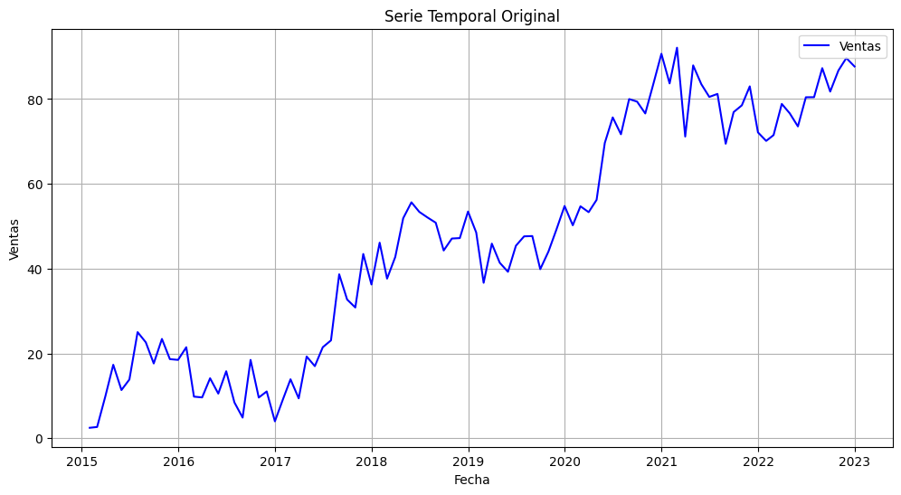
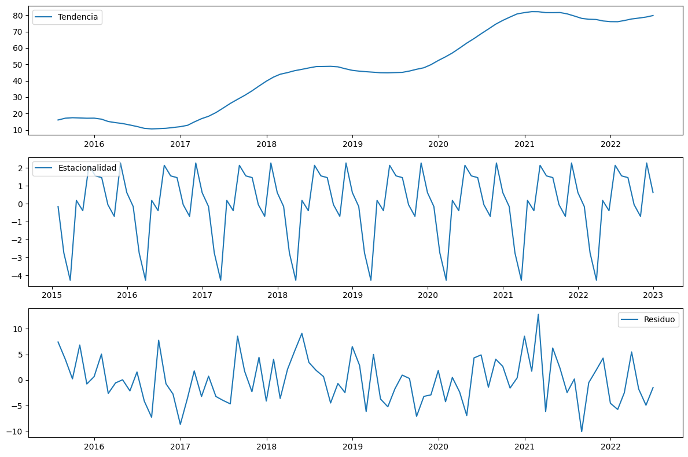
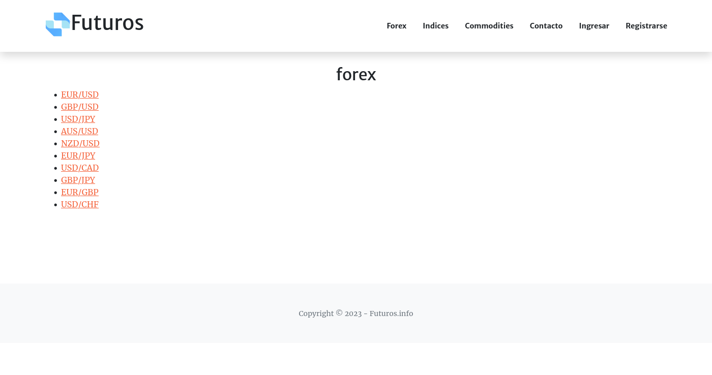
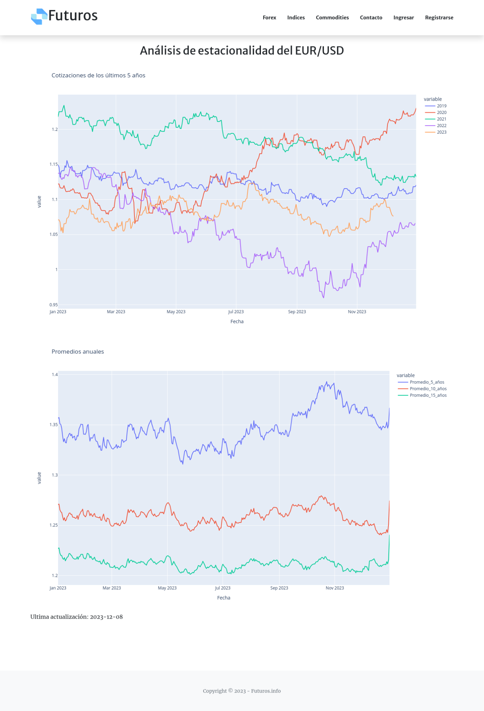

# TECNICATURA UNIVERSITARIA EN PROGRAMACIÓN

### **DATOS DEL ALUMNO**

> Apellido y Nombres: Pereira, Ariel Maximiliano

Índice

1.  Introducción..............................................................................3

2.  Objetivos de la Práctica
    > Profesional...............................................4

3.  Introducción al análisis
    > estacional..................................................5

4.  Tecnologías y herramientas
    > utilizadas...........................................13

5.  Documentación técnica del
    > proyecto..........................................\...15

6.  Puesta en línea de la
    > aplicación...................................................19

7.  Resultados y
    > logros...................................................................20

8.  Capturas de
    > pantalla..................................................................21

9.  Conclusiones..............................................\..............................23

10. Bibliografía...............................................................................25

# Introducción

Este informe documenta mi experiencia durante mi práctica
profesionalizante en el marco de la Tecnicatura Universitaria en
Programación impartida en la UTN Facultad Regional San Rafael.

La práctica se basó en una investigación que fusionó los conocimientos
adquiridos a lo largo de mi trayectoria académica con mi experiencia en
los mercados financieros. El proyecto principal se centró en el
desarrollo de un sitio web dedicado al análisis de la estacionalidad en
los movimientos de precios en futuros de índices, divisas y commodities.
Esta iniciativa va más allá de ser una mera experiencia técnica;
representa una convergencia entre la programación y las finanzas, dando
forma a una herramienta práctica y funcional.

A lo largo de este informe, se detallarán los objetivos de la práctica y
se explorarán los diferentes aspectos abordados, que incluyen la
investigación en análisis estacional, la arquitectura del proyecto, las
tecnologías empleadas, las funcionalidades del sitio y los aspectos
técnicos de su desarrollo.

El propósito fundamental de esta práctica es impulsar no solo mi
crecimiento personal y profesional, sino también proporcionar a otros
interesados en los mercados financieros herramientas y análisis
confiables. Esta combinación de investigación y desarrollo refleja mi
compromiso con el aprendizaje continuo y la aplicación práctica de mis
habilidades en un contexto real.

Es relevante destacar que este proyecto no solo está disponible en forma
de código abierto en GitHub, sino que también se ha implementado en
línea, permitiendo a los usuarios no solo explorar el código fuente,
sino también experimentar directamente con la aplicación y sus
funcionalidades en un entorno operativo real. Esta combinación de
accesibilidad y funcionalidad en línea demuestra el alcance tangible de
este proyecto más allá de sus aspectos técnicos.

Para visualizar la aplicación en línea ingresa a
[[www.futuros.info]{.underline}](http://www.futuros.info)

El código se encuentra en
[[www.github.com/arielmpereira/futuros.info]{.underline}](http://www.github.com/arielmpereira/futuros.info)

# Objetivos de la Práctica Profesional

La práctica profesionalizante se ha diseñado con el propósito de
alcanzar objetivos específicos que contribuyan de manera integral a mi
formación académica y al desarrollo de habilidades profesionales. A
continuación, se detallan los objetivos que guiaron esta experiencia:

**Aplicación de Conocimientos Adquiridos:**

Integrar y aplicar los conocimientos teóricos y prácticos obtenidos a lo
largo de la Tecnicatura Universitaria en Programación en un entorno de
desarrollo real.

**Investigación y Análisis Estacional:**

Realizar una investigación sobre la estacionalidad de los movimientos de
precios en futuros de índices, divisas y commodities. La investigación
se posiciona en el cruce entre la formación académica y las inquietudes
personales, buscando no solo fortalecer los fundamentos teóricos sino
también responder a preguntas específicas derivadas de la experiencia en
los mercados financieros.

**Desarrollo de Habilidades Técnicas:**

Perfeccionar las habilidades técnicas en desarrollo web, programación y
análisis de datos a través del diseño e implementación de un sitio web
funcional y útil.

**Generación de Herramientas Prácticas:**

Desarrollar un sitio web que provea a inversores y profesionales
financieros de herramientas y análisis confiables para la toma de
decisiones informadas en sus actividades.

#  

# 3. Introducción al análisis de series temporales

En el análisis de series temporales, la curva se descompone en tres
componentes clave que son la tendencia, la estacionalidad y el residuo.
Estos elementos facilitan la comprensión de patrones subyacentes y la
identificación de comportamientos significativos a lo largo del tiempo.

**Tendencia:**

La tendencia representa la dirección general o el patrón de crecimiento
o decrecimiento a largo plazo en una serie temporal.

Puede ser ascendente, descendente o seguir un patrón más complejo. La
tendencia muestra la evolución a largo plazo de la serie temporal,
ignorando las variaciones a corto plazo.

La eliminación de la tendencia ayuda a centrarse en patrones
estacionales y otros aspectos de variación.

**Estacionalidad:**

La estacionalidad se refiere a patrones recurrentes o ciclos que ocurren
con una frecuencia fija dentro de la serie temporal.

Estos ciclos suelen repetirse en períodos regulares, como diarios,
mensuales o anuales, y pueden deberse a factores estacionales,
climáticos, culturales, etc.

Al entender la estacionalidad, se puede anticipar cómo se comportará la
serie en ciertos momentos del año o del período analizado.

**Residuo:**

El residuo es la parte de la serie temporal que no puede ser explicada
por la tendencia ni la estacionalidad. Es la variación no sistemática o
aleatoria.

Puede contener información sobre eventos inesperados, errores en la
medición o cualquier otro factor impredecible.

El análisis del residuo es crucial para evaluar la calidad del modelo y
para identificar patrones no captados por la tendencia y la
estacionalidad.

Mediante la descomposición de una serie temporal en estos tres
componentes, los analistas pueden entender mejor la dinámica subyacente,
hacer predicciones más precisas y detectar anomalías o eventos
significativos. Además, esta descomposición es fundamental en técnicas
avanzadas como el modelado ARIMA (Autoregressive Integrated Moving
Average) y el análisis de regresión en series temporales.

Los conceptos de tendencia, estacionalidad y residuo son aplicables a
una variedad de situaciones en la vida real. Veamos algunos ejemplos
para ilustrar los conceptos:

**Ventas Minoristas:**

Tendencia: Una tienda minorista puede experimentar una tendencia
creciente en sus ventas a lo largo de varios años debido a una expansión
exitosa.

Estacionalidad: Durante la temporada navideña, es probable que las
ventas aumenten significativamente cada año debido a las compras
festivas.

Residuo: Variaciones diarias o semanales en las ventas que no pueden
atribuirse a la tendencia ni a la estacionalidad, como eventos de
promoción o cambios en la economía local.

**Producción Agrícola:**

Tendencia: La producción de ciertos cultivos puede mostrar una tendencia
ascendente debido a avances tecnológicos y prácticas agrícolas
mejoradas.

Estacionalidad: Cultivos como los cereales pueden mostrar variaciones
estacionales debido a las estaciones de siembra y cosecha.

Residuo: Impactos impredecibles como eventos climáticos extremos que
afectan la producción de manera no sistemática.

**Tráfico en Sitios Web:**

Tendencia: Un sitio web puede experimentar un crecimiento constante en
el tráfico a medida que gana popularidad.

Estacionalidad: Durante eventos especiales o lanzamientos de productos,
puede haber picos temporales en el tráfico.

Residuo: Fluctuaciones diarias en la cantidad de visitas que no se
pueden explicar por la tendencia ni por eventos estacionales.

**Datos Financieros:**

Tendencia: El rendimiento de una acción puede mostrar una tendencia
alcista o bajista a largo plazo debido a factores económicos o
decisiones estratégicas de la empresa.

Estacionalidad: En ciertos meses del año, algunas acciones pueden
experimentar aumentos o disminuciones predecibles debido a eventos
financieros estacionales.

Residuo: Movimientos diarios del mercado que no se pueden prever a
partir de la tendencia o la estacionalidad, como noticias repentinas o
eventos globales.

**Veamos un ejemplo en forma gráfica:**

{width="6.208333333333333in"
height="1.8072922134733158in"}

{width="6.267716535433071in"
height="4.166666666666667in"}

## Dificultad para visualizar la estacionalidad

La dificultad para visualizar la estacionalidad puede depender de varios
factores, y aquí hay algunas razones comunes por las cuales puede
resultar difícil identificarla en una serie temporal:

**Amplitud de la Estacionalidad:**

Si la amplitud de la componente estacional es pequeña en comparación con
las fluctuaciones aleatorias (ruido) en los datos, podría ser difícil
distinguir visualmente la estacionalidad.

**Frecuencia de la Estacionalidad:**

La estacionalidad a veces puede tener una frecuencia que no es
fácilmente discernible en el gráfico, especialmente si es muy rápida o
muy lenta.

**Tamaño del Conjunto de Datos:**

En conjuntos de datos pequeños, los patrones estacionales pueden no ser
tan evidentes. A medida que se acumulan más datos, los patrones
estacionales pueden volverse más claros.

**Ruido en los Datos:**

La presencia de ruido en los datos puede dificultar la identificación de
patrones subyacentes, incluida la estacionalidad.

## La descomposición

La descomposición de series temporales es un proceso fundamental en el
análisis de datos temporales, y existen varias formas de realizarla. A
continuación detallo dos de los métodos más comunes: la descomposición
clásica y la descomposición estacional-tendencia-residuo (STR).

**Descomposición Clásica:**

Método: Este método clásico asume que una serie temporal puede
descomponerse en tres componentes principales: tendencia, estacionalidad
y residuo.

**Procedimiento:**

La tendencia se obtiene aplicando técnicas de suavizado (como promedios
móviles o ajustes polinómicos) para resaltar la dirección general de la
serie.

La estacionalidad se identifica observando patrones recurrentes en la
serie en un intervalo específico (como diario, mensual o anual).

El residuo es la parte restante que no se explica por la tendencia ni
por la estacionalidad.

**Descomposición Estacional-Tendencia-Residuo (STR):**

Método: Esta es una forma más moderna de descomposición que utiliza
modelos estadísticos avanzados para separar la serie temporal en
componentes aditivas o multiplicativas.

**Procedimiento:**

Utiliza métodos como el modelo aditivo o multiplicativo de
descomposición estacional-tendencia-residuo (ETS) y el análisis de
regresión para descomponer la serie en tendencia, estacionalidad y
residuo.

Puede adaptarse mejor a patrones más complejos y variaciones no lineales
en los datos.

Ambos enfoques son útiles según el contexto y la naturaleza de los
datos. La descomposición clásica es más simple y fácil de entender,
mientras que la descomposición STR puede manejar mejor la variabilidad y
los patrones más complejos en las series temporales.

En Python, la biblioteca statsmodels proporciona funciones para realizar
la descomposición clásica y la descomposición STR. A continuación un
ejemplo simple de la descomposición clásica:

import pandas as pd

import numpy as np

import matplotlib.pyplot as plt

from statsmodels.tsa.seasonal import seasonal_decompose

\# Crear una serie temporal de ejemplo

np.random.seed(42)

date_rng = pd.date_range(start=\'2020-01-01\', periods=100, freq=\'D\')

data = np.sin(np.linspace(0, 4\*np.pi, 100)) +
np.random.normal(scale=0.2, size=100)

ts = pd.Series(data, index=date_rng)

\# Descomposición clásica

result = seasonal_decompose(ts, model=\'additive\', period=10)

\# Graficar la serie original, tendencia, estacionalidad y residuo

plt.figure(figsize=(12, 8))

plt.subplot(4, 1, 1)

plt.plot(ts, label=\'Original\')

plt.legend()

plt.subplot(4, 1, 2)

plt.plot(result.trend, label=\'Tendencia\')

plt.legend()

plt.subplot(4, 1, 3)

plt.plot(result.seasonal, label=\'Estacionalidad\')

plt.legend()

plt.subplot(4, 1, 4)

plt.plot(result.resid, label=\'Residuo\')

plt.legend()

plt.tight_layout()

plt.show()

Este código utiliza la función seasonal_decompose de statsmodels para
realizar la descomposición clásica y graficar las componentes. Puedes
ajustar el modelo (aditivo o multiplicativo) y otros parámetros según
tus necesidades.

## Análisis Histórico de Tendencias Estacionales en los Mercados de Forex

El Análisis Histórico del Mercado de Forex es una parte vital para
comprender y aprovechar las Tendencias Estacionales en Forex. Al
examinar detenidamente los patrones que han surgido en los principales
pares de divisas a lo largo de los años, los traders pueden descubrir
oportunidades potenciales e identificar posibles obstáculos. Este
análisis no es solo una observación superficial de las tendencias, sino
una comprensión más profunda de las dinámicas que impulsan el mercado de
Forex.

Por ejemplo, el dólar estadounidense, que a menudo experimenta una
tendencia de fortalecimiento al comienzo del año, puede atribuirse a
diversos factores, como políticas fiscales y la publicación de informes
económicos clave durante este período. Este patrón es un ejemplo clásico
de Patrones del Ciclo de Trading de Forex, que están lejos de ser
aleatorios. En cambio, son claros reflejos de fuerzas económicas y
geopolíticas subyacentes que ejercen una influencia significativa en los
valores de las divisas.

Un aspecto esencial del Análisis Histórico del Mercado de Forex implica
comprender el impacto de eventos económicos importantes en diferentes
monedas. Eventos como cambios en las tasas de interés, informes de
crecimiento económico y variaciones en las tasas de empleo son solo
algunos ejemplos que pueden causar movimientos significativos en el
mercado de Forex. Al analizar cómo estos eventos han afectado
históricamente a los pares de divisas, los traders pueden obtener
perspicacias sobre cómo podrían desarrollarse eventos futuros.

Otro factor crucial para entender las Tendencias Estacionales en Forex
es la estabilidad o inestabilidad geopolítica. Elecciones políticas,
cambios en las políticas gubernamentales y relaciones internacionales
pueden contribuir a las tendencias estacionales observadas en los
mercados de divisas. El Análisis Histórico del Mercado de Forex permite
a los traders evaluar cómo eventos políticos pasados han impactado en
los valores de las divisas y prever posibles tendencias durante eventos
similares en el futuro.

Además, no se puede subestimar el impacto de los cambios económicos
globales. Por ejemplo, el ascenso de mercados emergentes o un cambio en
los patrones de comercio mundial puede llevar a cambios significativos
en las Tendencias Estacionales en Forex. Al estudiar estos cambios
históricamente, los traders pueden anticipar y responder mejor a los
movimientos futuros del mercado.

Los Patrones del Ciclo de Trading de Forex también revelan la
interconexión de las economías globales. El rendimiento de una moneda
importante a menudo afecta a otras. Por ejemplo, un euro fuerte puede
correlacionarse con tendencias más débiles en otras monedas, como el
dólar estadounidense o la libra esterlina. Comprender estas relaciones a
través del análisis histórico es clave para dominar las Tendencias
Estacionales en Forex.

## Gráficos estacionales

¿Qué son los gráficos estacionales de forex? Para nuestros propósitos,
la estacionalidad es la tendencia de una divisa a subir o bajar, en
ciertos momentos del año. En lugar de mirar los últimos 5 o 10 años de
datos de divisas en orden cronológico, ¿qué pasaría si tomamos cada año
(de enero a diciembre) y pudieras poner cada año uno sobre otro? Todos
los años se promedian y se establecen en un valor inicial,
proporcionando una línea que muestra cómo actúa la divisa en promedio
entre enero y diciembre, durante los últimos 5 o 10 años.

Es importante tener en cuenta que la estacionalidad es un promedio. En
cualquier año, el precio puede desviarse de la tendencia estacional, por
lo tanto, la estacionalidad no es una herramienta para usar por sí sola
(aunque las estrategias pueden basarse en ella), sino que debe
combinarse con el análisis de precios para determinar puntos de entrada
y salida. La estacionalidad nos proporciona ventanas de tiempo donde
podemos observar posibles inversiones de tendencia y sentirnos más
seguros si vemos un patrón de precios que indica una reversión durante
ese tiempo, por ejemplo.

Es importante tener en cuenta la tendencia general del mercado; en
tendencias alcistas, usa los puntos bajos estacionales para comprar, en
tendencias bajistas, usa los puntos altos estacionales para vender en
corto.

## Análisis de los resultados de los promedios.

Analizar la estacionalidad visualizando los gráficos estacionales puede
ser muy laborioso en el caso de pretender analizar un grupo de activos
extenso , por ello es conveniente utilizar enfoques algorítmicos para
analizar la estacionalidad en lugar de depender únicamente de la
visualización manual de gráficos. Aquí hay algunas técnicas y algoritmos
que podrías considerar:

**Análisis de Fourier:**

La transformada de Fourier puede descomponer una serie temporal en sus
componentes de frecuencia. Al aplicarla, puedes identificar patrones
estacionales y calcular la fuerza de las componentes estacionales en tu
serie temporal.

**Descomposición Estacional (STL):**

La descomposición estacional lo hace automáticamente. Seasonal-Trend
decomposition using LOESS (STL) es una técnica que descompone una serie
temporal en componentes de tendencia, estacional y residual. Puedes
implementar esto en Python utilizando bibliotecas como statsmodels.

**Análisis Espectral:**

Utiliza métodos de análisis espectral para identificar patrones
estacionales en la frecuencia de la serie temporal. La densidad
espectral de potencia (PSD) puede ser útil para este propósito.

**Métodos Autoregresivos (ARIMA y SARIMA):**

Los modelos ARIMA (AutoRegressive Integrated Moving Average) y SARIMA
(Seasonal ARIMA) son modelos estadísticos que pueden capturar la
estacionalidad en una serie temporal y ayudarte a hacer predicciones.

**Descomposición Empírica de Modo (EMD):**

EMD es una técnica de descomposición adaptativa que puede extraer
componentes estacionales de una serie temporal de manera automática.

**Análisis de Diferencias Estacionales:**

Calcula las diferencias estacionales entre los promedios de diferentes
períodos y busca patrones o cambios significativos en estas diferencias.

**Machine Learning:**

Utiliza algoritmos de aprendizaje automático, como Random Forests o
Gradient Boosting, para modelar y prever la estacionalidad en función de
variables relevantes.

**Pruebas Estadísticas de Estacionalidad:**

Aplica pruebas estadísticas específicas de estacionalidad, como la
prueba de Dickey-Fuller aumentada, para evaluar la presencia de patrones
estacionales en tus datos.

#  

# 4. Tecnologías y herramientas utilizadas

El proyecto se diseñó con el objetivo de desarrollar un sitio web
integral para analizar la estacionalidad de los movimientos de precios
en futuros de índices, divisas y commodities. A continuación, se
presenta una descripción de los componentes clave de la arquitectura:

## **Frontend:**

Se emplea el framework **Flask** para el desarrollo del frontend,
aprovechando su flexibilidad y capacidad de integración con el backend.

**Bootstrap** se utiliza para la creación de interfaces web responsivas
y atractivas, garantizando una experiencia de usuario moderna y
accesible.

**Jinja2** se implementa como motor de plantillas para la generación
dinámica de contenido web, facilitando la presentación de datos en el
frontend.

**Plotly** se utiliza para la creación de gráficos interactivos,
proporcionando visualizaciones efectivas de los patrones estacionales en
los movimientos de precios.

## **Backend:**

Flask se utiliza también en el backend, proporcionando una estructura
flexible y eficiente para manejar las solicitudes del usuario. Se
implementan rutas y controladores específicos para gestionar las
consultas relacionadas con el análisis de la estacionalidad financiera.

**Base de Datos:**

SQLAlchemy se implementa como ORM (Mapeo Objeto-Relacional) para
interactuar con la base de datos SQL. Se emplea una base de datos SQL
para almacenar y gestionar los datos financieros necesarios para el
análisis estacional.

**Análisis de Datos:**

Se integran herramientas y bibliotecas especializadas para llevar a cabo
el análisis de la estacionalidad de los movimientos de precios tales
como Pandas, Numpy, statmodels, etc.

Algoritmos y técnicas estadísticas se aplican para identificar patrones
recurrentes y tendencias significativas en los datos financieros.

Para realizar gráficos se utiliza la librería Plotly

**Seguridad:**

Se implementa un sistema de autenticación de usuarios para garantizar
que solo usuarios autorizados tengan acceso al contenido y las
funcionalidades del sitio.

La información de inicio de sesión se gestiona de manera segura,
utilizando prácticas recomendadas de almacenamiento y cifrado de
contraseñas.

## Funcionalidades Principales:

**Obtención de Datos y almacenamiento:**

Utilizar la API yfinance para obtener datos diarios de cierre de activos
financieros.

Almacenamos los datos en una base de datos SQLite.

**Cálculo de Promedios Móviles:**

Calcular y almacenar los promedios móviles de los últimos 5 y 10 años
para cada activo.

**Interfaz Web Intuitiva:**

Desarrollar una interfaz web amigable con Flask que permita a los
usuarios seleccionar el activo que desea visualizar el análisis.

**Mostrar gráficos interactivos con datos de cierre y promedios
móviles.**

Posibilidad de comparar múltiples activos en una sola visualización.

**Interactividad y Personalización:**

Permitir a los usuarios ajustar la escala temporal y seleccionar activos
específicos.

Integrar controles de usuario para mejorar la interactividad.

**Seguridad y Privacidad:**

Implementar medidas de seguridad para proteger la aplicación.

Implementar registro de usuarios.

**Pruebas y Mantenimiento Continuo:**

Realizar pruebas exhaustivas para garantizar la estabilidad.

Realizar ajustes y mejoras según las retroalimentaciones de los
usuarios.

# 5.Documentación Técnica del proyecto

## 5.1 Estructura de la base de datos de cierres diarios.

La configuración de la base de datos para nuestro proyecto se basa en la
elección de una base de datos relacional SQL, una decisión motivada por
la necesidad de gestionar relaciones complejas y realizar consultas
estructuradas de manera eficiente, características esenciales para la
manipulación de datos financieros.

Para interactuar con la base de datos, hemos optado por el uso de
SQLAlchemy, un framework de mapeo objeto-relacional (ORM) en Python.
SQLAlchemy ofrece una interfaz poderosa y flexible para trabajar con
bases de datos SQL, permitiéndonos modelar entidades y relaciones de
manera intuitiva en código Python.

Además, hemos implementado un enfoque de particionamiento donde cada
mercado posee su propia tabla de cierres diarios. A continuación, se
presenta la estructura detallada de las tablas

### **Tabla tickets:**

La tabla Tickets es la entidad principal que almacena información sobre
los distintos activos financieros disponibles en el sistema. Cada activo
está representado por un \"ticket\" único, identificado por su
ticket_id. La estructura de la tabla es la siguiente:

-   **ticket_id** (Clave primaria, Auto_increment): Identificador único
    > para cada activo.

-   **ticket** (Texto): identificador o simbolo del activo.

-   **nombre**: Nombre del activo que se muestra al usuario.

-   **mercado**: Mercado al cual pertenece el activo

-   **ultima_actualizacion**: Ultima actualizacion de la cotizacion del
    > activo

-   **habilitado**: Variable booleana que indica si el activo esta
    > habilitado en el sitio.

### **Tabla forex_daily:**

Esta tabla almacena los cierres diarios de los pares de divisas del
mercado Forex.

-   **forex_id** (Clave primaria): Identificador único de cada registro.

-   **ticket_id** (Clave externa relacionada con la tabla Tickets):
    > Referencia al activo asociado en la tabla Tickets.

-   **fecha** (Fecha): Fecha del cierre diario.

-   **apertura** (Número decimal): Precio de apertura del activo en la
    > fecha dada.

-   **maximo** (Número decimal): Precio maximo del activo en la fecha
    > dada.

-   **minimo** (Número decimal): Precio minimo del activo en la fecha
    > dada.

-   **cierre** (Número decimal): Precio de cierre del activo en la fecha
    > dada.

### **Tabla indices_daily:**

Similar a la tabla forex_daily pero solo se almacenan las cotizaciones
de los índices.

### **Tabla comodities_daily:**

Similar a la tabla forex_daily pero solo se almacenan las cotizaciones
de los commodities.

### **Modelado de Base de Datos con SQLAlchemy:**

La base de datos relacional se modela utilizando SQLAlchemy para
aprovechar las siguientes ventajas:

**Abstracción Simplificada**: Evita la necesidad de consultas SQL
directas, permitiendo una interacción más intuitiva con la base de
datos.

**Flexibilidad en el Motor de Base de Dato**s: Facilita la transición
entre motores de bases de datos sin cambios significativos en el código,
brindando versatilidad al proyecto.

Para revisar la estructura detallada de la base de datos, consulta el
archivo
[[models.py]{.underline}](https://github.com/arielmpereira/futuros.info/blob/master/app/models.py).

## 5.2 Obtención de cotizaciones históricas de activos

Se eligió **Yahoo Finance** como fuente principal de los datos de cierre
diario debido a su fácil acceso, disponibilidad gratuita de datos
históricos y la cobertura de diversos activos financieros. Esta elección
se basó en su economía, facilidad de uso y confiabilidad para obtener
información precisa y completa sobre las cotizaciones de distintos
activos financieros a lo largo del tiempo.

En cuanto a la obtención de los datos de cierre diario de Yahoo Finance,
se empleó la librería **yfinance**. Esta herramienta facilitó la
conexión y descarga de datos financieros directamente desde la
plataforma de Yahoo.

Su integración en el proyecto permitió acceder de manera sencilla a la
información necesaria para realizar el análisis estacional de los
activos financieros. La inclusión de **yfinance** simplificó el proceso
de obtención de datos, garantizando su fiabilidad en el desarrollo del
sitio web.

Para gestionar el proceso de descarga de datos de Yahoo Finance, carga
en la base de datos y actualizaciones diarias, se implementó un
algoritmo que automatiza estas tareas. que se describe a continuación:

## 5.3 Actualización de Datos desde Yahoo Finance:

La funcionalidad de actualización de datos se implementa a través de la
ruta /**actualizar_datos** en el servidor web. Este proceso se encarga
de mantener la información de cierres diarios actualizada en la base de
datos. A continuación, se describen los pasos principales del algoritmo:

**Obtención de Tickets Activos:**

Se obtiene una lista de todos los tickets activos (habilitados)
almacenados en la base de datos.

**Iteración sobre los Tickets:**

Para cada ticket activo, se inicia un proceso de actualización.

**Obtención de Datos desde Yahoo Finance:**

Se utiliza la librería yfinance para obtener datos históricos de Yahoo
Finance desde la última fecha de actualización hasta el día actual.

**Actualización de la Base de Datos:**

Si se obtienen datos nuevos, se actualiza la tabla correspondiente en la
base de datos con la información recién adquirida.

**Confirmación de la Actualización:**

Se generan mensajes detallados para cada ticket procesado, indicando la
cantidad de registros actualizados y la fecha de última actualización.

**Informe final:**

Se devuelve un mensaje HTML que resume el proceso de actualización para
cada ticket.

## 5.4 Estudio de la estacionalidad

### **Gráficos de líneas**

En esta sección, se desarrolló un gráfico de líneas que visualiza los
precios de cierre diarios a lo largo de los últimos 5 años. Cada año se
representó con un color diferente, lo que facilitó la interpretación
visual de los movimientos de precios. Este gráfico proporciona una
representación intuitiva de las fluctuaciones a lo largo del tiempo,
permitiendo la identificación de posibles patrones estacionales en el
comportamiento del mercado.

### **Promedios Móviles Anuales:**

Además, se elaboraron tres gráficos distintos de promedios móviles
anuales. El primero refleja el promedio de los últimos 5 años, el
segundo representa el promedio de los últimos 10 años, y el tercero
muestra el promedio de los últimos 15 años. Estos promedios desempeñaron
un papel crucial al suavizar la curva temporal, proporcionando una
visualización clara de la estacionalidad. La inclusión de diferentes
periodos de tiempo en los promedios permitió verificar la consistencia
de la estacionalidad a lo largo de las décadas.

En conclusión, tanto los gráficos de los últimos 5 años como los
promedios móviles resultaron ser herramientas efectivas para analizar la
estacionalidad. Sin embargo, los métodos analíticos no proporcionaron
resultados favorables en esta etapa del análisis. Es esencial tener
presente la necesidad de ajustar cualquier modelo de manera prudente y
validar los resultados para garantizar la solidez de las conclusiones
obtenidas.

#  

# 6. Puesta en línea de la Aplicación: Resumen de Pasos Esenciales

En esta sección daremos un resumen de los pasos fundamentales seguidos
para poner nuestra aplicación en línea, haciéndola accesible a través de
Internet.

**1. Adquisición de un \"Droplet\" en Digital Ocean:**

Contratamos un \"droplet\" en [[Digital
Ocean]{.underline}](http://www.digitalocean.com), una máquina virtual
que se convierte en nuestro servidor en Internet.

Seleccionamos un servidor con Debian GNU/Linux y optamos por un plan
económico inicial, con flexibilidad para escalabilidad según nuestras
necesidades

**2. Configuración Inicial del Droplet:**

> Realizamos la configuración inicial del servidor, abordando aspectos
> como:

-   Actualización e instalación del software necesario.

-   Creación de una cuenta de usuario para una gestión más segura.

-   Implementación de un firewall para reforzar la seguridad.

-   Instalación de la aplicación en el servidor.

-   Creación del entorno virtual de Python para encapsular y gestionar
    > las dependencias de la aplicación.

**3. Configuración del Servidor Web Nginx:**

Configuramos Nginx, nuestro servidor web, para gestionar las solicitudes
entrantes y actuar como intermediario entre el cliente y la aplicación.

Definimos la gestión de archivos estáticos y establecemos las rutas para
dirigir eficientemente las solicitudes al servidor de aplicaciones.

**4. Apuntar el Dominio a Nuestro Servidor Virtual:**

Asociamos el dominio \"futuros.info\" con nuestro servidor virtual,
facilitando el acceso a la aplicación mediante un nombre de dominio
personalizado.

Configuramos los registros DNS para garantizar la correcta redirección
del dominio al servidor, permitiendo que los usuarios accedan a la
aplicación de manera rápida y confiable.

Siguiendo estos pasos, hemos logrado no solo desplegar nuestra
aplicación en línea de manera efectiva sino también garantizar que esté
configurada de manera segura y eficiente para satisfacer las demandas de
los usuarios conectados a Internet.

# 7. Resultados y logros

**Desarrollo del Sitio Web:**

El sitio web no solo satisface los requisitos establecidos, sino que
también destaca por su eficiente ejecución en todas las fases del ciclo
de vida de los datos: obtención, almacenamiento, limpieza, procesamiento
y visualización. El uso del framework **Flask**, junto con el entorno de
desarrollo **PyCharm** y la colaboración a través de **GitHub**, ha sido
fundamental en la consecución de estos resultados.

**Puesta en Línea Exitosa:**

La aplicación se encuentra exitosamente en línea, alojada en un servidor
virtual propio y accesible a través de un dominio personalizado. Esta
implementación asegura una disponibilidad constante para los usuarios
finales. La implementación en la nube, aprovechando los servicios de
cloud computing, ha acelerado significativamente el proceso de puesta en
línea. Además, este enfoque ha demostrado ser económicamente viable,
ofreciendo una solución eficiente y rentable para la disponibilidad en
línea de proyectos.

**Exploración de Datos:**

La aplicación logra ofrecer una perspectiva única al presentar
cotizaciones desde un enfoque no convencional. Destaca la importancia de
considerar la estacionalidad en los movimientos de precios,
proporcionando a los usuarios una comprensión más profunda de los
patrones del mercado.

**Herramientas Analíticas Utilizadas:**

Pandas para Análisis de Datos Estacionales: La utilización efectiva de
la librería Pandas ha sido crucial para el análisis de datos
estacionales, permitiendo la manipulación y exploración eficiente de
conjuntos de datos complejos.

**Plotly para Visualización de Resultados:**

La integración de Plotly como herramienta de visualización ha
enriquecido significativamente la presentación de resultados, ofreciendo
gráficos interactivos que facilitan la comprensión de los patrones
estacionales identificados.

# 8. Capturas de pantalla de la aplicación

## Página principal

{width="4.3125in"
height="4.240863954505687in"}

## Listado de activos

{width="5.159722222222222in"
height="2.7169969378827648in"}

## Gráficos estacionales

{width="5.263527996500438in"
height="7.729166666666667in"}

# 9. Conclusiones

Durante el desarrollo de este proyecto de investigación y creación del
sitio web, se han extraído valiosas lecciones que contribuirán al
continuo crecimiento y mejora de la plataforma.

## Lecciones Aprendidas

**Importancia de la forma en que se visualizan los precios.**

La adopción de gráficos no convencionales para representar la
estacionalidad demostró ser una herramienta efectiva. La visualización
no tradicional proporcionó una perspectiva distinta y más intuitiva de
los patrones estacionales. Es fundamental reconocer que, aunque la
estacionalidad no constituye por sí misma una estrategia de inversión,
sí se presenta como una herramienta valiosa que puede potenciar nuestras
estrategias operativas.

**Limitaciones de Métodos Analíticos Actuales:**

A pesar de los esfuerzos, los métodos analíticos aplicados no arrojaron
resultados significativos en esta etapa del proyecto. Esta limitación
resalta la necesidad de explorar enfoques analíticos adicionales que
complementen la visualización de datos. La combinación de métodos
analíticos más robustos podría proporcionar una comprensión más completa
de los patrones estacionales en los movimientos de precios.

**Tecnologías Utilizadas**

La elección de tecnologías como Flask, SQLAlchemy y la librería yfinance
fue crucial para el desarrollo eficiente de la plataforma. Flask
proporcionó un marco ágil y fácil de usar para construir el sitio web,
mientras que SQLAlchemy simplificó la interacción con la base de datos.
La integración de yfinance facilitó la obtención de datos financieros,
contribuyendo a la robustez del análisis estacional.

## Perspectivas Futuras

**Exploración de Nuevos Enfoques Analíticos**

Como parte de la evolución continua de la plataforma, se tiene la
intención de explorar y desarrollar enfoques analíticos adicionales.
Estos nuevos métodos analíticos buscarán proporcionar una comprensión
más profunda y detallada de los patrones estacionales en los movimientos
de precios. La incorporación de técnicas más avanzadas y modelos
analíticos más sofisticados permitirá una interpretación más precisa y
completa de la estacionalidad en los mercados financieros.

**Innovación en la Representación Visual de Datos**

La innovación en la representación visual de datos seguirá siendo un
foco clave para futuras investigaciones. Se explorarán nuevas
posibilidades y técnicas que permitan una visualización aún más efectiva
de los patrones estacionales. La importancia de presentar datos de
manera intuitiva y comprensible es fundamental para brindar a los
usuarios una experiencia analítica enriquecedora.

**Perfeccionamiento Continuo de Enfoques Analíticos**

El compromiso con el perfeccionamiento continuo de enfoques analíticos
se mantendrá como una prioridad. Se buscará integrar metodologías
analíticas emergentes y perfeccionar las existentes para garantizar que
la plataforma siga creciendo en el análisis estacional de los mercados
financieros. Este proceso de mejora constante se apoyará en la
retroalimentación de los usuarios y la evaluación constante de nuevas
herramientas y técnicas.

#  

# 10. Bibliografía

Time Series Analysis using ARIMA and LSTM(in Python and Keras)-Part1
[[https://medium.com/analytics-vidhya/time-series-analysis-using-arima-and-lstm-in-python-and-keras-part1-f987e11f9f8c]{.underline}](https://medium.com/analytics-vidhya/time-series-analysis-using-arima-and-lstm-in-python-and-keras-part1-f987e11f9f8c)

Time Series Analysis using ARIMA and LSTM(in Python and Keras)-Part2
[[https://medium.com/analytics-vidhya/time-series-analysis-using-arima-and-lstm-in-python-and-keras-part2-74a79636568]{.underline}](https://medium.com/analytics-vidhya/time-series-analysis-using-arima-and-lstm-in-python-and-keras-part2-74a79636568)

Finding Seasonal Trends in Time-Series Data with Python
[[https://towardsdatascience.com/finding-seasonal-trends-in-time-series-data-with-python-ce10c37aa861]{.underline}](https://towardsdatascience.com/finding-seasonal-trends-in-time-series-data-with-python-ce10c37aa861)

Mastering Forex Seasonal Trends: A Comprehensive Guide to Navigating
Currency Market Cycles with Confidence
[[https://medium.com/@das.onuraag/mastering-forex-seasonal-trends-a-comprehensive-guide-to-navigating-currency-market-cycles-with-f2e405b6c357]{.underline}](https://medium.com/@das.onuraag/mastering-forex-seasonal-trends-a-comprehensive-guide-to-navigating-currency-market-cycles-with-f2e405b6c357)
